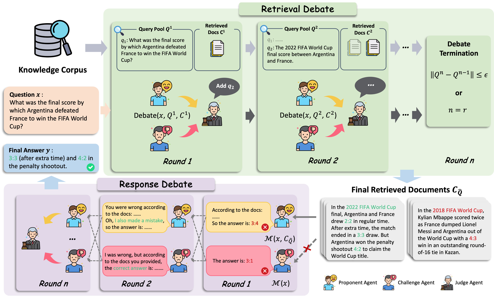

<div align="center">

# Removal of Hallucination on Hallucination: Debate-Augmented RAG

<h4>
  <a href='https://github.com/Huenao' target='_blank'>Wentao Hu<sup>1</sup></a>
  ·
  <a href='https://wengyuzhang.com/' target='_blank'>Wengyu Zhang<sup>1</sup></a>
  ·
  <a href='https://yyjiang.com/' target='_blank'>Yiyang Jiang<sup>1</sup></a>
  ·
  <a href='https://www.zhangchen.info/' target='_blank'>Chen Jason Zhang<sup>1</sup></a>
  ·
  <a href='https://www4.comp.polyu.edu.hk/~x1wei/' target='_blank'>Xiaoyong Wei<sup>2,1,*</sup></a>
  ·
  <a href='https://www4.comp.polyu.edu.hk/~csqli/' target='_blank'>Qing Li<sup>1</sup></a>
</h4>

<p><sup>1</sup>The Hong Kong Polytechnic University &nbsp;&nbsp;<sup>2</sup>Sichuan University
<br><sup>*</sup>Corresponding author &nbsp;&nbsp;


[![Conference](https://img.shields.io/badge/ACL_2025-grey.svg?style=flat&logo=data:image/svg+xml;base64,PD94bWwgdmVyc2lvbj0iMS4wIiBlbmNvZGluZz0iVVRGLTgiIHN0YW5kYWxvbmU9Im5vIj8+CjwhLS0gQ3JlYXRlZCB3aXRoIElua3NjYXBlIChodHRwOi8vd3d3Lmlua3NjYXBlLm9yZy8pIC0tPgo8c3ZnCiAgIHhtbG5zOnN2Zz0iaHR0cDovL3d3dy53My5vcmcvMjAwMC9zdmciCiAgIHhtbG5zPSJodHRwOi8vd3d3LnczLm9yZy8yMDAwL3N2ZyIKICAgdmVyc2lvbj0iMS4wIgogICB3aWR0aD0iNjgiCiAgIGhlaWdodD0iNjgiCiAgIGlkPSJzdmcyIj4KICA8ZGVmcwogICAgIGlkPSJkZWZzNCIgLz4KICA8cGF0aAogICAgIGQ9Ik0gNDEuOTc3NTUzLC0yLjg0MjE3MDllLTAxNCBDIDQxLjk3NzU1MywxLjc2MTc4IDQxLjk3NzU1MywxLjQ0MjExIDQxLjk3NzU1MywzLjAxNTggTCA3LjQ4NjkwNTQsMy4wMTU4IEwgMCwzLjAxNTggTCAwLDEwLjUwMDc5IEwgMCwzOC40Nzg2NyBMIDAsNDYgTCA3LjQ4NjkwNTQsNDYgTCA0OS41MDA4MDIsNDYgTCA1Ni45ODc3MDgsNDYgTCA2OCw0NiBMIDY4LDMwLjk5MzY4IEwgNTYuOTg3NzA4LDMwLjk5MzY4IEwgNTYuOTg3NzA4LDEwLjUwMDc5IEwgNTYuOTg3NzA4LDMuMDE1OCBDIDU2Ljk4NzcwOCwxLjQ0MjExIDU2Ljk4NzcwOCwxLjc2MTc4IDU2Ljk4NzcwOCwtMi44NDIxNzA5ZS0wMTQgTCA0MS45Nzc1NTMsLTIuODQyMTcwOWUtMDE0IHogTSAxNS4wMTAxNTUsMTcuOTg1NzggTCA0MS45Nzc1NTMsMTcuOTg1NzggTCA0MS45Nzc1NTMsMzAuOTkzNjggTCAxNS4wMTAxNTUsMzAuOTkzNjggTCAxNS4wMTAxNTUsMTcuOTg1NzggeiAiCiAgICAgc3R5bGU9ImZpbGw6I2VkMWMyNDtmaWxsLW9wYWNpdHk6MTtmaWxsLXJ1bGU6ZXZlbm9kZDtzdHJva2U6bm9uZTtzdHJva2Utd2lkdGg6MTIuODk1NDExNDk7c3Ryb2tlLWxpbmVjYXA6YnV0dDtzdHJva2UtbGluZWpvaW46bWl0ZXI7c3Ryb2tlLW1pdGVybGltaXQ6NDtzdHJva2UtZGFzaGFycmF5Om5vbmU7c3Ryb2tlLWRhc2hvZmZzZXQ6MDtzdHJva2Utb3BhY2l0eToxIgogICAgIHRyYW5zZm9ybT0idHJhbnNsYXRlKDAsIDExKSIKICAgICBpZD0icmVjdDIxNzgiIC8+Cjwvc3ZnPgo=)]()


</div>


## 🌟 Introduction
*This repo is the official implementation of **DRAG** (**D**ebate-Augmented **RAG**), a novel training-free framework, designed to reduce hallucinations in Retrieval-Augmented Generation (RAG) systems.*



Retrieval-Augmented Generation (RAG) is designed to mitigate hallucinations in large language models (LLMs) by retrieving relevant external knowledge to support factual generation. However, *biased or erroneous retrieval results can mislead the generation, compounding the hallucination problem rather than solving it*. In this work, we refer to this cascading issue as *__Hallucination on Hallucination__*, a phenomenon where the model’s factual mistakes are not just due to internal reasoning flaws, but also triggered or worsened by unreliable retrieved content.

To address this, we implement **DRAG**, a training-free framework that integrates multi-agent debate mechanisms into both the retrieval and generation stages. These debates help dynamically refine queries, reduce bias, and promote factually grounded, robust answers.

## 🔥 News

🔥 __[May 24, 2025]:__ The paper and Code were released!\
🔥 __[May 16, 2025]:__ Our paper was accepted by ACL 2025!


## 🚀 QuickStart


## ✨ Acknowledgments
[FlashRAG](https://github.com/RUC-NLPIR/FlashRAG/tree/main):A Python toolkit for the reproduction and development of Retrieval Augmented Generation (RAG) research. We thank the authors for their excellent work.


## 🔗 Citation
Thank you for your interest in our work. If this work is useful to you, please cite it as follows:
```bibtex

```